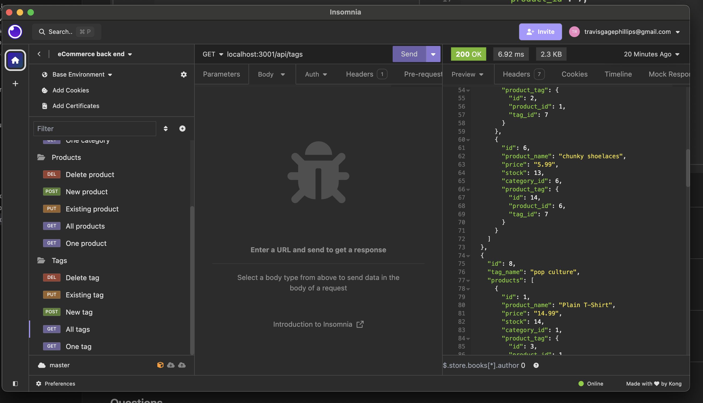

# e-commerce-back-end

## Description
The following is the back-end infrastructure for an e-commerce site using Express.js, Sequelize, and PostgreSQL. The starter code was provided and the challenge was to create the database relations and the routes to execute CRUD operations. The application provides users a way to manage the inventory for a mock ecommerce site using categories, products, and tags, with functionality for adding new items and editing existing ones, including all relevants information such as name, price, stock, etc.

## Table of Contents
* [Installation](#installation)
* [Usage](#usage)
* [License](#license)
* [Contributing](#contributing)
* [Credits](#credits)
* [Tests](#tests)
* [Questions](#questions)

## Installation
Installation instructions:
run "npm i" or "npm install" to install dependencies

## Usage
Click [here](https://drive.google.com/file/d/1wfXcgJIo86IePNZTpIsszmbx6HTvWIqa/view?usp=drive_link) for a video walkthrough of the application.

To use the application, make sure you have Node.js and PostgreSQL are installed, with a .env file to connect to PSQL. Within postgreSQL, run the schema file to create the database, exit PSQL, and run "npm run seed" in your CLI.  "Node server.js" executed in the CLI will then start the application.  With the server running, endpoints and routes can then be checked in Insomnia or similar program to interact with the application through html requests. Within the three areas of categories, products, and tags, users can view (GET) all, view one, create (POST) a new one, PUT an existing entry, or remove (DELETE) one.

## License
This project is operating under the MIT license.  For more detailed information, please click [here](https://opensource.org/license/mit).

## Contributing
See my contact information 

## Credits
N/A

## Tests
To run tests for the application:
N/A

## Questions
Contact me for any questions regarding this project:

GitHub: [Travis-Phillips](https://github.com/travisgage)

Email: travisgagephillips@gmail.com
